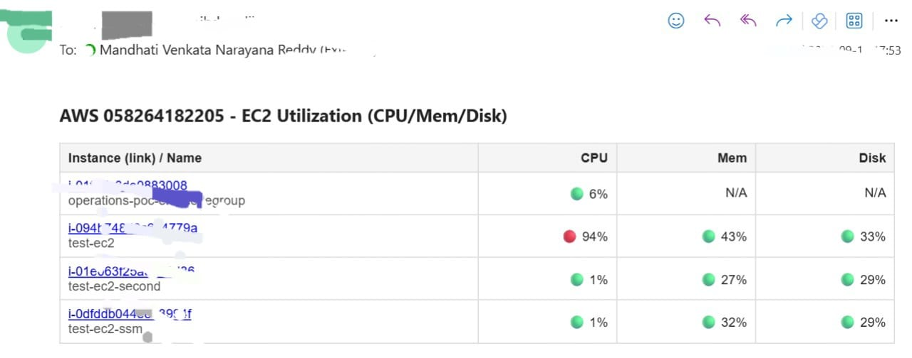

# EC2 Resource Utilization Alerts (CPU/Mem/Disk)

End‑to‑end AWS EC2 utilization monitoring with **AWS CloudWatch + CloudWatch Agent + AWS SES + Microsoft Teams**.  
Runs as an AWS Lambda function and posts **alerts-only** (WARN/ALERT) to a Teams channel and optional email.

---

## What this does

1. Scans **running EC2 instances** (optionally filtered by a specific tag).
2. Pulls utilization metrics:
   - **CPU**: `AWS/EC2 :: CPUUtilization` (Average)
   - **Memory**: `CWAgent :: mem_used_percent` (requires CloudWatch Agent)
   - **Disk**: `CWAgent :: disk_used_percent` (requires CloudWatch Agent; picks the **max** across discovered disks)
3. Classifies per-instance status by thresholds → **OK / WARN / ALERT**.
4. Sends **Microsoft Teams Adaptive Cards** and **HTML Email** listing **only offenders** (instances breaching WARN/ALERT on any metric).
5. Skips notifications when there are **no offenders**.

> Memory/Disk require the **CloudWatch Agent** on instances. Without it, CPU is still evaluated; missing metrics do **not** trigger alerts.

---

## Sample Output

EC2 Utilization Alert (Adaptive Card)



## Repository layout

```
EC2_Resource_Utilization/
├─ app/
│  ├─ __init__.py
│  └─ main.py              # Lambda entrypoint: app.main.lambda_handler
├─ compute/
│  ├─ __init__.py
│  └─ handler.py           # EC2 scan, thresholds, CW/SES/Teams integrations
└─ shared/
   ├─ __init__.py
   ├─ collectors.py        # Account label via STS
   └─ teams.py             # Teams webhook + simple card
```

---

## Runtime architecture

```
┌──────────────┐     list/metrics     ┌──────────────┐
│   Lambda     │ ───────────────────▶ │ CloudWatch   │
│  (handler)   │ ◀─────────────────── │  (EC2/CWAgent│
└─────┬────────┘   datapoints         └──────┬───────┘
      │                                     │
      │ SES: send_email                      │ CWAgent on EC2 for mem/disk
      ▼                                     ▼
┌──────────────┐                      ┌──────────────┐
│     AWS SES  │                      │   EC2 Hosts  │
└─────┬────────┘                      └──────────────┘
      │
      ▼  HTTP Webhook
┌──────────────┐
│  MS Teams    │
└──────────────┘
```

---

## Lambda handler

- **Module**: `app.main`
- **Function**: `lambda_handler`
- Creates a `boto3.Session` and calls `compute.handler.run(...)`.
- Returns a JSON summary like: `{"ok": true, "modules": {"compute": {"ok": true, "instances": N, "alerts_sent": M}}}`

---

## Environment variables

| Variable | Default | Description |
|---|---|---|
| `AWS_REGION` | `us-east-1` | Region used by the Lambda session. |
| `TEAMS_WEBHOOK` | **required** | MS Teams Incoming Webhook URL. Used if Teams alerts are enabled. |
| `ENABLE_COMPUTE` | `true` | Toggle the compute module from `app/main.py`. |
| `ENABLE_EC2_UTILIZATION` | `true` | Toggle EC2 utilization check within compute handler. |
| `CPU_WARN` | `70` | CPU WARN threshold (%) |
| `CPU_ALERT` | `90` | CPU ALERT threshold (%) |
| `MEM_WARN` | `70` | Memory WARN threshold (%) |
| `MEM_ALERT` | `90` | Memory ALERT threshold (%) |
| `DISK_WARN` | `80` | Disk WARN threshold (%) |
| `DISK_ALERT` | `90` | Disk ALERT threshold (%) |
| `INSTANCE_TAG_KEY` | *(empty)* | Optional tag key to filter instances. |
| `INSTANCE_TAG_VALUE` | *(empty)* | Optional tag value to filter instances. |
| `WINDOW_MIN` | `10` | Lookback window in minutes used to query metrics. |
| `PERIOD` | `60` | Metric period in seconds (1‑minute buckets). |
| `MAX_INSTANCES` | `200` | Safety cap on number of EC2 instances scanned. |
| `ROWS_PER_CARD` | `20` | Max rows per Teams card (cards are chunked). |
| `LOG_LEVEL` | `INFO` | Python logging level (`DEBUG`, `INFO`, `WARNING`, …). |
| `LOG_1MIN_SERIES` | `true` | When `true`, logs a 1‑min series per metric to CloudWatch Logs for debugging. |
| `ENABLE_MAIL_REPORT` | `true` | When `true` and mail fields are provided, sends email via SES. |
| `MAIL_FROM` | *(empty)* | Verified SES sender (e.g., `alerts@example.com`). |
| `MAIL_TO` | *(empty)* | Comma/semicolon separated recipients. |
| `MAIL_CC` | *(empty)* | Optional CC list (comma/semicolon separated). |
| `MAIL_BCC` | *(empty)* | Optional BCC list (comma/semicolon separated). |
| `MAIL_SUBJECT` | `EC2 Utilization Alerts - X instance(s)` | Optional subject override. |

Notes:
- Only instances with level `WARN` or `ALERT` are included in Teams and Email reports.
- Missing metrics are treated as **OK** (do not generate alerts).

---

## Threshold logic

- For each instance we take:  
  `CPU = AWS/EC2:CPUUtilization (Average)`  
  `MEM = max(CWAgent:mem_used_percent)` across discovered dimensions for that instance  
  `DISK = max(CWAgent:disk_used_percent)` across disks
- Metric → level mapping:  
  `>= ALERT → ALERT`, `>= WARN → WARN`, else `OK`  
- Row level is the **worst** of CPU/MEM/DISK.

---

## Microsoft Teams output

- Adaptive Card titled: **“{AWS_ACCOUNT_ID} – Compute (CPU/Mem/Disk) – ⚠ Offenders”**
- Columns: **Instance‑ID/Name**, **CPU**, **Mem**, **Disk**
- Multiple cards are sent if offenders exceed `ROWS_PER_CARD`.

Example row formatting in Teams/Email includes emoji severity:
- `🟢 OK`, `🟡 WARN`, `🔴 ALERT`

---

## Email output (AWS SES)

- HTML table with columns: **Instance (link)/Name**, **CPU**, **Mem**, **Disk**  
- Includes direct links to the EC2 console for each instance.
- Skips entirely if any of the following are missing/disabled:
  - `ENABLE_MAIL_REPORT` is not truthy
  - `MAIL_FROM` is empty
  - `MAIL_TO` is empty

**SES requirements**:
- Verify `MAIL_FROM` identity in the configured `AWS_REGION`.
- If account is in SES sandbox, verify recipient identities as well or move the account out of sandbox.

---

## Permissions (minimal IAM)

Attach an execution role to the Lambda with at least:

```json
{
  "Version": "2012-10-17",
  "Statement": [
    {
      "Effect": "Allow",
      "Action": [
        "ec2:DescribeInstances"
      ],
      "Resource": "*"
    },
    {
      "Effect": "Allow",
      "Action": [
        "cloudwatch:GetMetricStatistics",
        "cloudwatch:ListMetrics"
      ],
      "Resource": "*"
    },
    {
      "Effect": "Allow",
      "Action": [
        "ses:SendEmail",
        "ses:SendRawEmail"
      ],
      "Resource": "*"
    },
    {
      "Effect": "Allow",
      "Action": "sts:GetCallerIdentity",
      "Resource": "*"
    }
  ]
}
```

---

## Deployment (AWS Lambda)

1. **Package**
   - Zip the project folder contents (ensure the root contains `app/`, `compute/`, `shared/`).
2. **Create Lambda**
   - Runtime: Python 3.11+
   - Handler: **`app.main.lambda_handler`**
   - Memory/Timeout: set as per estate size (e.g., 512–1024 MB, 30–60s).
3. **Environment variables**
   - Set values from the table above. `TEAMS_WEBHOOK` is required for Teams.
   - If using email, set `ENABLE_MAIL_REPORT=true`, `MAIL_FROM`, `MAIL_TO`.
4. **Execution role**
   - Attach permissions shown above.
5. **Trigger / Schedule**
   - Create an **EventBridge rule** (e.g., every 5 or 10 minutes).  
     Use a fixed rate that matches your metric resolution and cost targets.

> Memory/Disk require **CloudWatch Agent** on EC2. Install the agent and enable `mem_used_percent` and `disk_used_percent` metrics. Without the agent, CPU alerts still work.

---

## Local testing (optional)

```bash
python - <<'PY'
import os, boto3
from app.main import lambda_handler

# Set env vars for a dry test
os.environ["AWS_REGION"] = "us-east-1"
os.environ["TEAMS_WEBHOOK"] = "https://outlook.office.com/webhook/..."  # dummy or test channel
os.environ["ENABLE_MAIL_REPORT"] = "false"  # skip SES during local smoke test

print(lambda_handler({}, None))
PY
```

For fully offline unit tests, mock `boto3` clients for `ec2`, `cloudwatch`, and `ses`.

---

## Cost & operational notes

- **CloudWatch GetMetricStatistics** calls scale with instances × metrics × time buckets (use `WINDOW_MIN`/`PERIOD` wisely).
- **Teams & Email** are sent **only** when there are offenders; this reduces noise.
- Consider a separate **INFO-only** scheduled run that posts a short “No issues” card if your team wants a heartbeat message.

---

## Troubleshooting

- **No Memory/Disk values** → Install/verify **CloudWatch Agent** on the instances; check `CWAgent` namespace for `mem_used_percent`/`disk_used_percent`.
- **Email not sent** → Check `ENABLE_MAIL_REPORT`, `MAIL_FROM`, `MAIL_TO`, and SES identity verification / sandbox.
- **No Teams messages** → Confirm `TEAMS_WEBHOOK` is set and reachable from Lambda subnets (if in a VPC with egress controls).
- **Too many instances** → Tune `INSTANCE_TAG_KEY/INSTANCE_TAG_VALUE` and/or reduce `MAX_INSTANCES`.
- **No offenders** → Expected behavior; the function does not spam when all values are OK.

---

## Roadmap / ideas

- Add GPU, network, and EBS burst metrics.
- Per‑ASG aggregation and auto‑remediation hooks.
- Slack output alongside Teams.
- CSV/JSON artifact upload to S3 for audit/history.

---
